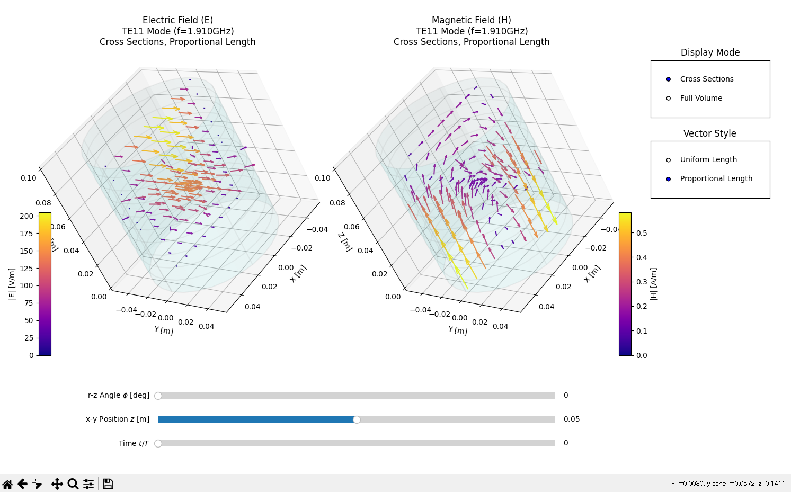

# Cylindrical Waveguide 3D Interactive Viewer

An interactive 3D visualization tool for electromagnetic fields in a cylindrical waveguide. Based on analytical solutions of TE and TM modes.

円筒導波管内における電磁界分布を、解析解に基づいて3次元空間上でリアルタイムに可視化・探索できるツールです。

 *(Note: Replace this link with your actual screenshot after uploading)*

## Features | 特徴

- **Interactive 3D Visualization**: Explore E and H fields using synchronized dual 3D plots.
- **Cross-Sectional Exploration**: Dynamically move R-Z and X-Y planes using sliders to inspect the field structure inside.
- **Full Volume Mode**: Toggle between sliced views and a sparse full-volume grid view.
- **Mode Selection**: Supports various high-order TE and TM modes (TE11, TM01, TE21, etc.).
- **Physical Insights**: View field magnitudes with uniform or proportional vector lengths.
- **Standalone UI**: Easy parameter setup (Radius, Length, Mode numbers) via a built-in startup dialog.

- **3Dインタラクティブ可視化**: 電場（E）と磁場（H）を左右に並べ、同期した3Dグラフで探索可能。
- **自由な断面切り出し**: スライダーにより r-z 平面や x-y 平面を動かし、導波管内部を詳細に観察。
- **モード切り替え**: 各種高次TE/TMモード（TE11, TM01, TE21等）を瞬時に計算。
- **スタートアップUI**: 起動用ダイアログで導波管の寸法やモード、格子の密度を簡単に設定可能。

## Requirements | 動作環境

- Python 3.8+
- NumPy
- SciPy
- Matplotlib

*(Standard library `tkinter` is required for the setup dialog)*

## Usage | 使い方

1. Clone or download this repository.
2. Run the interactive viewer:
   ```bash
   python interactive_3d_viewer.py
   ```
3. Set your parameters (Radius, Length, Mode, etc.) in the startup dialog and click **"Launch 3D Viewer"**.

1. リポジトリをダウンロードまたはクローンします。
2. 以下のコマンドを実行します。
   ```bash
   python interactive_3d_viewer.py
   ```
3. 表示されるダイアログで寸法やモードを設定し、「Launch 3D Viewer」を押してください。

## Files | ファイル構成

- `interactive_3d_viewer.py`: Main application script with GUI.
- `cylindrical_waveguide_solver.py`: Analytical solver engine for TE/TM modes.
- `.gitignore`: Git exclusion settings.

## License | ライセンス

MIT License (or your preferred license)

---
Developed for electromagnetic field verification and educational purposes.
電磁界解析コードの検証および教育用ツールとして開発されました。
